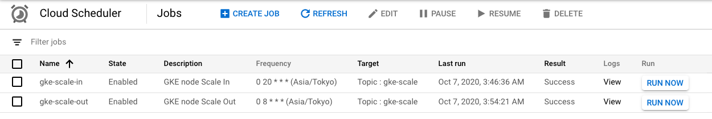

# Batch System

## Overview

+ Set up a batch that changes the number of GKE nodes on a regular basis

## Architect

WIP

## Auth GCP

+ GCP login using Web Browser

```
gcloud auth login -q
```

## Define Variable

+ Define Your Variable

```
export _project='Your GCP Project ID'
export _common='handson-gke'
export _region='asia-northeast1'
```

## Create GKE Cluster

+ Create Your GKE Cluster using Scripts

```
bash ../00_basic-cluster/operate-basic-cluster.sh create ${_project} ${_common} ${_region}
```

## Prepare API

+ Enable API on Project

```
gcloud config set project ${_project}
gcloud beta services enable sourcerepo.googleapis.com
gcloud beta services enable cloudbuild.googleapis.com
gcloud beta services enable cloudscheduler.googleapis.com
gcloud beta services enable appengine.googleapis.com
```

## Add Permission to Service Account of Cloud build

+ Check List of Service Accounts

```
gcloud beta iam service-accounts list --project ${_project}
```

+ Check Service account email of Cloud Build

```
export _cloud_build_sa_email=$(gcloud beta projects get-iam-policy ${_project} --format=json | jq -r '.bindings[] | select(.role == "roles/cloudbuild.builds.builder") | .members[]')

echo ${_cloud_build_email}
```

+ Add Permission

```
gcloud beta projects add-iam-policy-binding ${_project} --member=${_cloud_build_sa_email} --role=roles/container.admin
```

+ ReCheck Service account email of Cloud Build

```
WIP
```

## Create and Push Source Repository

+ Create Source Repository

```
export _repo_name='handson-gke-gsr'

gcloud beta source repos create ${_repo_name} --project ${_project}
```

+ Check Source Repository

```
gcloud beta source repos list --project ${_project} | grep ${_repo_name}
```
```
### Ex.

# gcloud beta source repos list --project ${_project} | grep ${_repo_name}
handson-gke-gsr  'your-gcp-project-id'  https://source.developers.google.com/p/your-gcp-project-id/r/handson-gke-gsr
```

+ Add git remote repository

```
git remote add gsr $(gcloud beta source repos list --project ${_project} | grep ${_repo_name} | awk '{print $3}')
```

+ Check git remote repository

```
# git remote -v
origin      https://github.com/iganari/handson-gke.git (fetch)
origin      https://github.com/iganari/handson-gke.git (push)
gsr         https://source.developers.google.com/p/your-gcp-project-id/r/handson-gke-gsr (fetch)
gsr         https://source.developers.google.com/p/your-gcp-project-id/r/handson-gke-gsr (push)
```

+ Push to Source Repository

```
git push gsr master
```

## Create and Run Trigger of Cloud Build

+ create Trigger of scale-in 

```
gcloud beta builds triggers create cloud-source-repositories \
  --repo ${_repo_name} \
  --name "gke-scale-in" \
  --branch-pattern "^master$" \
  --build-config 01_batch-system/builds/cloudbuild_gke-scale.yaml \
  --substitutions _NUM_NODE=0,_PROJCT_ID=${_project},_CLUSTER="${_common}-zonal",_ZONE="${_region}-a",_NODE_POOL="${_common}-zonal-nodepool" \
  --project ${_project}
```

+ create Trigger of scale-out 

```
gcloud beta builds triggers create cloud-source-repositories \
  --repo ${_repo_name} \
  --name "gke-scale-out" \
  --branch-pattern "^master$" \
  --build-config 01_batch-system/builds/cloudbuild_gke-scale.yaml \
  --substitutions _NUM_NODE=1,_PROJCT_ID=${_project},_CLUSTER="${_common}-zonal",_ZONE="${_region}-a",_NODE_POOL="${_common}-zonal-nodepool" \
  --project ${_project}
```

+ test run trigger

```
gcloud beta builds triggers run gke-scale-in  --branch master
gcloud beta builds triggers run gke-scale-out --branch master
```

## Check Trigger ID of Cloud Build

+ Check Trigger ID of `gke-scale-in`

```
export _scale_in_id=$(gcloud beta builds triggers describe gke-scale-in --project ${_project} | grep id | awk '{print $2}')
```

+ Check Trigger ID of  `gke-scale-out`

```
export _scale_out_id=$(gcloud beta builds triggers describe gke-scale-out --project ${_project} | grep id | awk '{print $2}')
```

## Create Topic in Pub/Sub

+ Create Topic

```
export _topic_name='gke-scale'

gcloud pubsub topics create ${_topic_name} --project ${_project}
```

## Deploy Cloud Fucntions

+ Deploy Cloud Functions by specifying the PubSub Topic you just created.

```
gcloud beta functions deploy gke-scale \
  --source=./functions \
  --entry-point=gke_scale \
  --runtime=nodejs10 \
  --trigger-topic="${_topic_name}" \
  --region ${_region} \
  --project ${_project}
```

## Create and Run Cloud Scheduler Job

+ Create scheduler job of Scalse In

```
gcloud beta scheduler jobs create pubsub gke-scale-in \
  --description 'GKE node Scale In' \
  --schedule '0 20 * * *' \
  --time-zone 'Asia/Tokyo' \
  --topic "projects/${_project}/topics/${_topic_name}" \
  --message-body 'GKE node Scale In' \
  --attributes "_gcp_pj_id=${_project},_trigger_id=${_scale_in_id}" \
  --project ${_project}
```

+ Create scheduler job of Scalse Out

```
gcloud beta scheduler jobs create pubsub gke-scale-out \
  --description 'GKE node Scale Out' \
  --schedule '0 8 * * *' \
  --time-zone 'Asia/Tokyo' \
  --topic "projects/${_project}/topics/${_topic_name}" \
  --message-body 'GKE node Scale Out' \
  --attributes "_gcp_pj_id=${_project},_trigger_id=${_scale_out_id}" \
  --project ${_project}
```

+  Check GCP Console




+ Run Schduler of Scale Out

```
gcloud beta scheduler jobs run gke-scale-out --project ${_project}
```

+ Run Schduler of Scale In

```
gcloud beta scheduler jobs run gke-scale-in --project ${_project}
```

## Finally

Degenerate unused resources to reduce costs.

Have fun! :)
