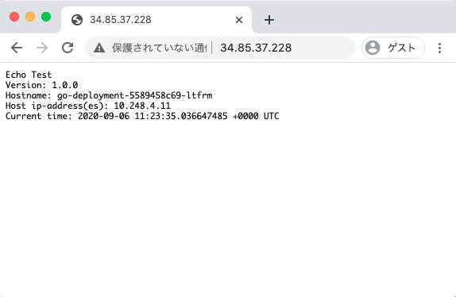
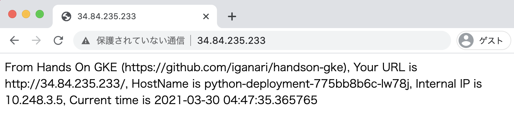
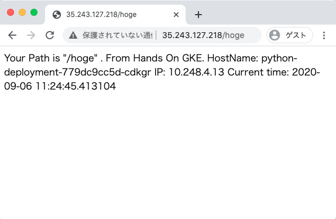
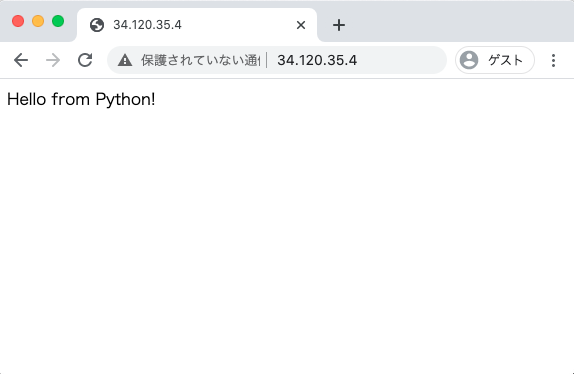
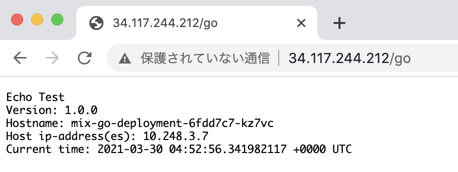
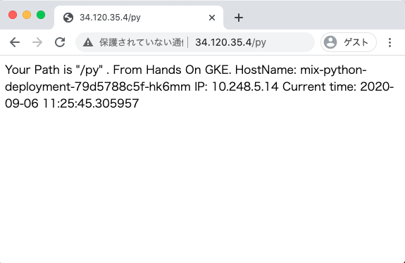
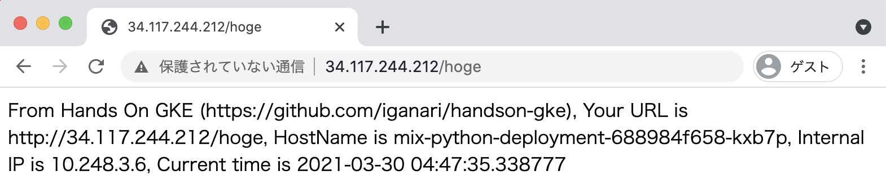

# Hands On GKE Hello World

## 概要

```
hogehoge
```

+ 以下のクラスタを作成したとする
  + Cluster name = `handson-gke`
    + Zonal Cluster
    + Zone = `asia-northeast1-a`

```
### New Env

export _project='Your GCP Project ID'
export _common='handson-gke'
export _region='asia-northeast1'
```

## Auth GCP

```
gcloud auth login -q
```

## Deploy Image for Container Registry

+ Google Container Registry の認証

```
gcloud auth configure-docker
```

+ go 用の Container Image を Push する

```
cd go

docker build . --tag gcr.io/${_project}/handson-gke_hello-world-go:v1
docker push gcr.io/${_project}/handson-gke_hello-world-go:v1

cd -
```

+ Python 用の Container Image を Push する

```
cd python

docker build . --tag gcr.io/${_project}/handson-gke_hello-world-python:v1
docker push gcr.io/${_project}/handson-gke_hello-world-python:v1

cd -
```

+ Check Images

```
gcloud beta container images list --project ${_project}
```

## Create GKE Cluster

+ スクリプトで GKE クラスタを作成する

```
bash ../00_basic-cluster/operate-basic-cluster.sh create ${_project} ${_common} ${_region}
```

## Auth GKE Cluster

+ 作成したクラスターに認証を通す

```
gcloud beta container clusters get-credentials ${_common}-zonal \
  --zone ${_region}-a \
  --project ${_project}
```

## Create Go Resource

+ Create YAML 

```
sed "s/YOUR_PROJECT/${_project}/g" hello-world-go.yaml.template > hello-world-go.yaml
```

+ Create Go Resource on Cluster

```
kubectl create -f hello-world-go.yaml
```

## Create Python Resource

+ Create YAML 

```
sed "s/YOUR_PROJECT/${_project}/g" hello-world-python.yaml.template > hello-world-python.yaml
```

+ Create Python Resource on Cluster

```
kubectl create -f hello-world-python.yaml
```

## Create Mix Resource

+ Create YAML 

```
sed "s/YOUR_PROJECT/${_project}/g" hello-world-mix.yaml.template > hello-world-mix.yaml
```

+ Create Go & Python Resource on Cluster

```
kubectl create -f hello-world-mix.yaml
```

## Check Browser

+ Check Service on hello-world-go

```
kubectl get service --namespace hello-world-go
```
```
### Ex.

# kubectl get service --namespace hello-world-go
NAME         TYPE           CLUSTER-IP      EXTERNAL-IP    PORT(S)        AGE
go-service   LoadBalancer   10.251.243.56   34.85.37.228   80:30068/TCP   66m
```




+ Check Service on hello-world-python

```
kubectl get service --namespace hello-world-python
```
```
### Ex.

# kubectl get service --namespace hello-world-python
NAME             TYPE           CLUSTER-IP       EXTERNAL-IP      PORT(S)        AGE
python-service   LoadBalancer   10.251.244.194   35.243.127.218   80:31465/TCP   65m
```




+ Check Ingress on hello-world-mix

```
kubectl get ingress --namespace hello-world-mix
```
```
### Ex.

# kubectl get ingress --namespace hello-world-mix
NAME          HOSTS   ADDRESS       PORTS   AGE
mix-ingress   *       34.120.35.4   80      64m
```






## Delete K8s Resource

+ Delete 

```
kubectl delete -f hello-world-go.yaml
kubectl delete -f hello-world-python.yaml
kubectl delete -f hello-world-mix.yaml
```

## Delete Container Registry

+ コンテナレジストリの確認

```
gcloud beta container images list --project ${_project}
```

+ WIP

```
gcloud beta container images delete gcr.io/${_project}/handson-gke_hello-world-go:v1 --project ${_project}

gcloud beta container images delete gcr.io/ca-igarashi-gke-sample/handson-gke_hello-world-python:v1 --project ${_project}
```

## Delete GKE Cluster

```
bash ../00_basic-cluster/operate-basic-cluster.sh delete ${_project} ${_common} ${_region}
```

## Advansed

### Q1. 負荷試験でどこまで耐えられるか見る

たとえば、 Apache Bench を用いて、 Pod が正常にレスポンスを返す CPU, memory を算出する

回答例 -> WIP

### Q2. CPU, Memmory の Limit を設定

Q1 の情報を元に、deployment の CPU, Memmory の Limit を設定する 

回答例 -> WIP

### Q3. pod のオートスケールを設定

pod のオートスケールを設定し、負荷を掛け、意図したとおりにスケールアップするか確認する

場合に応じて、node のオートスケールも設定する

回答例 -> WIP

### Q4. HTTPS を設定してみよう

Managed Certificate を使用して、 HTTPS で表示出来るようにしましょう

※ ドメインは別途自分で用意する必要があります。

回答例 -> [answer-04](./advansed/answer-04.md)
