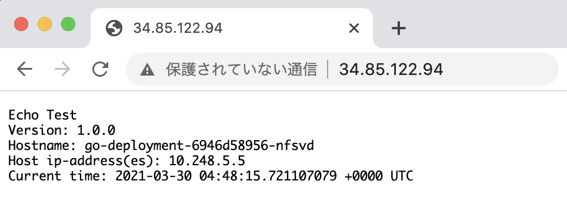
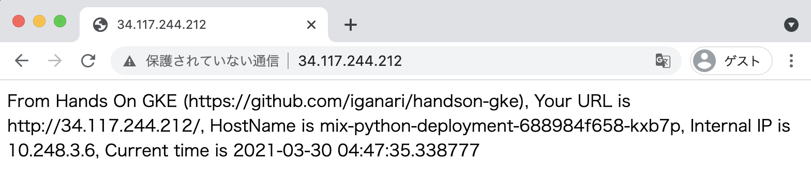

# Hands On GKE Hello World

## 概要

+ Namespace を作成し、 Namespace 毎に違うアプリケーションを実行してみる

目次

+ [Hands On](./README.md#hands-on)
  + [Prepare Env](./README.md#prepare-env)
  + [Auth GCP](./README.md#auth-gcp)
  + [Deploy Image for Container Registry](./README.md#deploy-image-for-container-registry)
  + [Create GKE Cluster](./README.md#create-gke-cluster)
  + [Auth GKE Cluster](./README.md#auth-gke-cluster)
  + [Create Go Resource](./README.md#create-go-resource)
  + [Create Python Resource](./README.md#create-python-resource)
  + [Create Mix Resource](./README.md#create-mix-resource)
  + [Check Browser](./README.md#check-browser)
+ [Advansed](./README.md#advansed)
+ [Delete Resource](./README.md#delete-resource)
  + [Delete K8s Resource](./README.md#delete-k8s-resource)
  + [Delete Container Registry](./README.md#delete-container-registry)
  + [Delete GKE Cluster](./README.md#delete-gke-cluster)

# Hands On

## Prepare Env

+ 以下のクラスタを作成したとする
  + Cluster name = `handson-gke`
    + Zonal Cluster
    + Zone = `asia-northeast1-a`

```
### New Env

export _gcp_pj_id='Your GCP Project ID'
export _common='handson-gke'
export _region='asia-northeast1'
```

## Auth GCP

```
gcloud auth login -q
```

## Deploy Image for Container Registry

+ Google Container Registry の認証

```
gcloud auth configure-docker
```

+ go 用の Container Image を Push する

```
cd go

docker build . --tag gcr.io/${_gcp_pj_id}/${_common}_hello-world-go:v1
docker push gcr.io/${_gcp_pj_id}/${_common}_hello-world-go:v1

cd -
```

+ Python 用の Container Image を Push する

```
cd python

docker build . --tag gcr.io/${_gcp_pj_id}/${_common}_hello-world-python:v1
docker push gcr.io/${_gcp_pj_id}/${_common}_hello-world-python:v1

cd -
```

+ Check Images

```
gcloud beta container images list --project ${_gcp_pj_id}
```
```
### 例

# gcloud beta container images list --project ${_gcp_pj_id}
NAME
gcr.io/[your_gcp_pj_id]/handson-gke_hello-world-go
gcr.io/[your_gcp_pj_id]/handson-gke_hello-world-python
```

## Create GKE Cluster

+ スクリプトで GKE クラスタを作成する

```
bash ../00_basic-cluster/operate-basic-cluster.sh create ${_gcp_pj_id} ${_common} ${_region}
```

+ 確認

```
gcloud beta container clusters list --project ${_gcp_pj_id}
```
```
### 例

# gcloud beta container clusters list --project ${_gcp_pj_id}
NAME               LOCATION           MASTER_VERSION    MASTER_IP     MACHINE_TYPE  NODE_VERSION      NUM_NODES  STATUS
handson-gke-zonal  asia-northeast1-a  1.18.15-gke.1501  35.200.37.26  e2-medium     1.18.15-gke.1501  3          RUNNING
```

## Create External IP Address

+ Reserving an External IP Address.

```
gcloud beta compute addresses create mix-ip-addr \
    --ip-version=IPV4 \
    --global \
    --project ${_gcp_pj_id}
```

+ Check External IP Address.

```
gcloud beta compute addresses describe mix-ip-addr \
    --format="get(address)" \
    --global \
    --project ${_gcp_pj_id}
```
```
### 例

# gcloud beta compute addresses describe mix-ip-addr \
>     --format="get(address)" \
>     --global \
>     --project ${_gcp_pj_id}
34.117.244.212
```

## Auth GKE Cluster

+ 作成したクラスターに認証を通す

```
gcloud beta container clusters get-credentials ${_common}-zonal \
  --zone ${_region}-a \
  --project ${_gcp_pj_id}
```

## Create Go Resource

+ Create YAML 

```
cp -a hello-world-go.yaml.template      hello-world-go.yaml
sed -i "s/YOUR_PROJECT/${_gcp_pj_id}/g" hello-world-go.yaml
sed -i "s/COMMON/${_common}/g"          hello-world-go.yaml
```

+ Create Go Resource on Cluster

```
kubectl create -f hello-world-go.yaml
```

## Create Python Resource

+ Create YAML 

```
cp -a hello-world-python.yaml.template  hello-world-python.yaml
sed -i "s/YOUR_PROJECT/${_gcp_pj_id}/g" hello-world-python.yaml
sed -i "s/COMMON/${_common}/g"          hello-world-python.yaml
```

+ Create Python Resource on Cluster

```
kubectl create -f hello-world-python.yaml
```

## Create Mix Resource

+ Create YAML 

```
cp -a hello-world-mix.yaml.template     hello-world-mix.yaml
sed -i "s/YOUR_PROJECT/${_gcp_pj_id}/g" hello-world-mix.yaml
sed -i "s/COMMON/${_common}/g"          hello-world-mix.yaml
```

+ Create Go & Python Resource on Cluster

```
kubectl create -f hello-world-mix.yaml
```

## Check Browser

+ Check Service on hello-world-go

```
kubectl get service --namespace hello-world-go
```
```
### Ex.

# kubectl get service --namespace hello-world-go
NAME         TYPE           CLUSTER-IP       EXTERNAL-IP    PORT(S)        AGE
go-service   LoadBalancer   10.251.245.191   34.85.122.94   80:31796/TCP   91s
```




+ Check Service on hello-world-python

```
kubectl get service --namespace hello-world-python
```
```
### Ex.

# kubectl get service --namespace hello-world-python
NAME             TYPE           CLUSTER-IP       EXTERNAL-IP     PORT(S)        AGE
python-service   LoadBalancer   10.251.255.250   34.84.235.233   80:30149/TCP   2m36s
```


+ Check Ingress on hello-world-mix

```
kubectl get ingress --namespace hello-world-mix
```
```
### Ex.

# kubectl get ingress --namespace hello-world-mix
NAME          CLASS    HOSTS   ADDRESS          PORTS   AGE
mix-ingress   <none>   *       34.117.244.212   80      4m2s
```




---> Web Browser で確認出来れば完了です!! :)

# Advansed

追加のハンズオンも是非やってみて下さい :)

[](./advansed)

# Delete Resource

## Delete K8s Resource

+ Delete 

```
kubectl delete -f hello-world-go.yaml
kubectl delete -f hello-world-python.yaml
kubectl delete -f hello-world-mix.yaml
```

## Delete Container Registry

+ コンテナレジストリの確認

```
gcloud beta container images list --project ${_gcp_pj_id}
```

+ コンテナレジストリの中のイメージを削除

```
gcloud beta container images delete \
    gcr.io/${_gcp_pj_id}/${_common}_hello-world-go:v1 \
    --project ${_gcp_pj_id}

gcloud beta container images delete \
    gcr.io/${_gcp_pj_id}/${_common}_hello-world-python:v1 \
    --project ${_gcp_pj_id}
```

## Release External IP Address

```
gcloud beta compute addresses delete \
    mix-ip-addr \
    --global \
    --project ${_gcp_pj_id}
```

## Delete GKE Cluster

```
bash ../00_basic-cluster/operate-basic-cluster.sh delete ${_gcp_pj_id} ${_common} ${_region}
```

## まとめ

Have fan! :)
