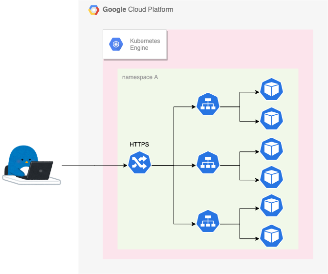
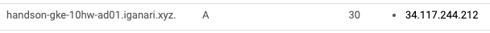
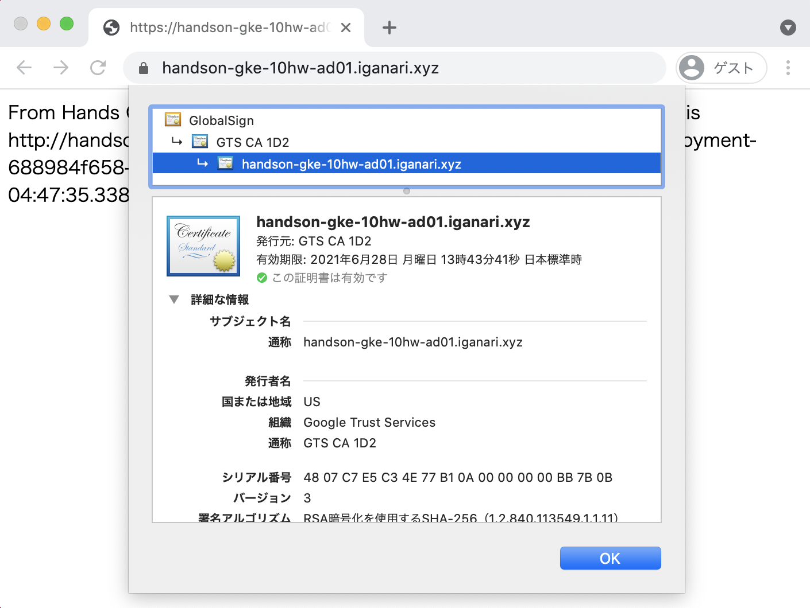

# Answer 01

## Q1. HTTPS を設定してみよう

Managed Certificate を使用して、 HTTPS で表示出来るようにしましょう

※ ドメインは別途自分で用意する必要があります。

## Answer

+ kind `ManagedCertificate` を作成する 
+ Ingress の annotation を設定する

## 参考にする公式ドキュメント

+ Using Google-managed SSL certificates
  + https://cloud.google.com/kubernetes-engine/docs/how-to/managed-certs?hl=en

# 実際にやってみる

:warning: 既に mix までの構築が完了していることを前提とします

## 現状の LB を確認

+ IP アドレスの確認

```
# kubectl get ingress --namespace hello-world-mix
NAME          HOSTS   ADDRESS       PORTS   AGE
mix-ingress   *       34.120.35.4   80      5h10m
```

+ curl で確認

```
# curl 34.120.35.4
Hello from Python!%
```
```
# curl 34.120.35.4/go
Echo Test
Version: 1.0.0
Hostname: mix-go-deployment-5f44894cfb-nflxp
Host ip-address(es): 10.248.5.3
Current time: 2020-09-12 05:28:51.608705772 +0000 UTC
```
```
# curl 34.120.35.4/py
Your Path is "/py" .
From Hands On GKE.
HostName: mix-python-deployment-79d5788c5f-dj2hp
IP: 10.248.6.3
Current time: 2020-09-12 05:29:51.250117
```

---> 良さそう

## LB のドメインを自分のドメインのサブドメとしてAレコードを登録する

+ 例



```
# dig A hello-world-mix.hejda.org +short
34.120.35.4
```

## ManagedCertificate を追加する

+ マニフェストに以下を追記する(サブドメイン `hello-world-mix.hejda.org` を使った例)

```
---
apiVersion: networking.gke.io/v1beta2
kind: ManagedCertificate
metadata:
  name: mix-certificate
  namespace: hello-world-mix
spec:
  domains:
    - hello-world-mix.hejda.org
```

+ 修正内容を適用

```
kubectl apply -f hello-world-mix.yaml
```

+ コマンドラインで確認

```
# kubectl get managedcertificate --namespace hello-world-mix
NAME              AGE
mix-certificate   53s
```
```
kubectl describe managedcertificate mix-certificate --namespace hello-world-mix
```
```
### 例: プロビジョニング中

# kubectl describe managedcertificate mix-certificate --namespace hello-world-mix | grep Status
Status:
  Certificate Status:  Provisioning
  Domain Status:
    Status:  Provisioning
```

## ingress を修正

+ 修正前

```
apiVersion: extensions/v1beta1
kind: Ingress
metadata:
  name: mix-ingress
  namespace: hello-world-mix
  annotations:
    kubernetes.io/ingress.global-static-ip-name: "ingress"    # Fix IP Address using Static IP Address
  labels:
    app: mix
spec:

...以下割愛
```

+ 修正後

```
apiVersion: extensions/v1beta1
kind: Ingress
metadata:
  name: mix-ingress
  namespace: hello-world-mix
  annotations:
    kubernetes.io/ingress.global-static-ip-name: "ingress"    # Fix IP Address using Static IP Address
    kubernetes.io/ingress.allow-http: "false"                 # Block if coming via http
    networking.gke.io/managed-certificates: mix-certificate
  labels:
    app: mix
spec:

...以下割愛
```

+ 修正を適用

```
kubectl apply -f hello-world-mix.yaml
```

+ openssl コマンドで確認

```
openssl s_client -connect hello-world-mix.hejda.org:443 -showcerts < /dev/null 2>&1
```
```
openssl s_client -connect hello-world-mix.hejda.org:443 -showcerts < /dev/null 2>&1 | grep '[si]:'
```

## Web Browser で確認

+ トップページを確認



+ 証明書の確認



## まとめ

Have fan !! :)
 
