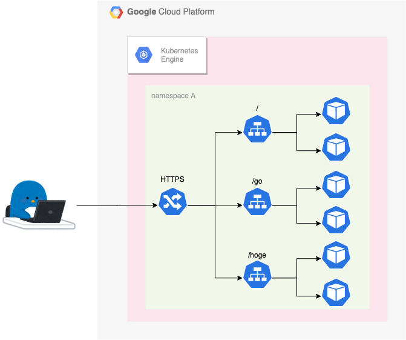
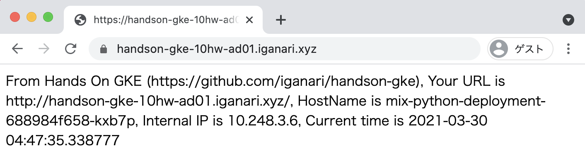

# Advansed Q1 Answer

## Q1. HTTPS を設定してみよう

Managed Certificate を使用して、 HTTPS で表示出来るようにしましょう

※ ドメインは別途自分で用意する必要があります。



## Answer

+ kind `ManagedCertificate` を作成する 
+ Ingress の annotation を設定する

## 参考にする公式ドキュメント

+ Using Google-managed SSL certificates
  + https://cloud.google.com/kubernetes-engine/docs/how-to/managed-certs?hl=en

# 実際にやってみる

:warning: 既に mix までの構築が完了していることを前提とします

## 現状の LB を確認

+ IP アドレスの確認

```
kubectl get ingress --namespace hello-world-mix
```
```
### 例

# kubectl get ingress --namespace hello-world-mix
NAME          CLASS    HOSTS   ADDRESS          PORTS   AGE
mix-ingress   <none>   *       34.117.244.212   80      32m
```

+ cURL で確認

```
# curl 34.117.244.212
From Hands On GKE (https://github.com/iganari/handson-gke),
Your URL is http://34.117.244.212/,
HostName is mix-python-deployment-688984f658-kxb7p,
Internal IP is 10.248.3.6,
Current time is 2021-03-30 04:47:35.338777
```
```
# curl 34.117.244.212/go
Echo Test
Version: 1.0.0
Hostname: mix-go-deployment-6fdd7c7-zkpgz
Host ip-address(es): 10.248.5.8
Current time: 2021-03-30 05:21:54.873796704 +0000 UTC
```
```
# curl 34.117.244.212/py
From Hands On GKE (https://github.com/iganari/handson-gke),
Your URL is http://34.117.244.212/py,
HostName is mix-python-deployment-688984f658-688fl,
Internal IP is 10.248.4.7,
Current time is 2021-03-30 04:47:34.402257
```

---> 良さそう

## LB のドメインを自分のドメインのサブドメとしてAレコードを登録する

+ 例


```
# dig A handson-gke-10hw-ad01.iganari.xyz +short
34.117.244.212
```

## ManagedCertificate を追加する

+ マニフェストに以下を `hello-world-mix.yaml` に追記する
  + 下記はサブドメイン `handson-gke-10hw-ad01.iganari.xyz` を使った例

```
---
apiVersion: networking.gke.io/v1beta2
kind: ManagedCertificate
metadata:
  name: mix-certificate
  namespace: hello-world-mix
spec:
  domains:
    - handson-gke-10hw-ad01.iganari.xyz
```

+ 修正内容をデプロイ

```
kubectl apply -f hello-world-mix.yaml
```

+ コマンドラインで確認

```
kubectl get managedcertificate --namespace hello-world-mix
```
```
### 例

# kubectl get managedcertificate --namespace hello-world-mix
NAME              AGE
mix-certificate   53s
```

+ コマンドラインで確認

```
kubectl describe managedcertificate mix-certificate --namespace hello-world-mix
```
```
### 例

# kubectl describe managedcertificate mix-certificate --namespace hello-world-mix | grep Status
Status:
  Certificate Status:  Provisioning
  Domain Status:
    Status:  Provisioning
```

## ingress を修正

`hello-world-mix.yaml` の ingress の設定部分を修正する

+ 修正前

```
apiVersion: networking.k8s.io/v1beta1
kind: Ingress
metadata:
  name: mix-ingress
  namespace: hello-world-mix
  annotations:
    kubernetes.io/ingress.global-static-ip-name: "mix-ip-addr"
  labels:
    app: mix
spec:

...以下割愛
```

+ 修正後
  + HTTP を受け付けない設定を追加 `kubernetes.io/ingress.allow-http: "false"`
  + ManagedCertificate を追加 `networking.gke.io/managed-certificates: mix-certificate`

```
apiVersion: extensions/v1beta1
kind: Ingress
metadata:
  name: mix-ingress
  namespace: hello-world-mix
  annotations:
    kubernetes.io/ingress.global-static-ip-name: "mix-ip-addr"
    kubernetes.io/ingress.allow-http: "false"
    networking.gke.io/managed-certificates: mix-certificate
  labels:
    app: mix
spec:

...以下割愛
```

+ 修正内容をデプロイ

```
kubectl apply -f hello-world-mix.yaml
```

+ openssl コマンドで確認

```
openssl s_client -connect handson-gke-10hw-ad01.iganari.xyz:443 -showcerts < /dev/null 2>&1 | grep '[si]:'
```
```
### 例

openssl s_client -connect handson-gke-10hw-ad01.iganari.xyz:443 -showcerts < /dev/null 2>&1 | grep '[si]:'
 0 s:/CN=handson-gke-10hw-ad01.iganari.xyz
   i:/C=US/O=Google Trust Services/CN=GTS CA 1D2
 1 s:/C=US/O=Google Trust Services/CN=GTS CA 1D2
   i:/OU=GlobalSign Root CA - R2/O=GlobalSign/CN=GlobalSign
```

## Web Browser で確認

+ トップページを確認



+ 証明書の確認


## まとめ

Q3 にて、HTTPS を設定が出来ました

Have fan !! :)
 
