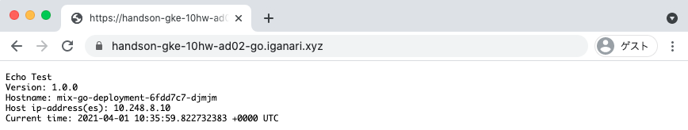

# Advansed Q2 Answer

## Q2. 複数のドメインを登録し、出し分ける

Managed Certificate を使用して、 HTTPS で表示出来るようにしましょう

※ Q1 をクリアしている必要があります。


## Answer

+ `spac.rules.host` を使う

# 実際にやってみる

:warning: 既に [Advansed Q1](../01) までの構築が完了していることを前提とします

## 現状の LB を確認

### GCP コンソールから確認

+ URL Map


## ドメインの用意

+ 使用したい用意しておくドメインに GCLB の External IP Address を設定しておく

```
### 例

handson-gke-10hw-ad02.iganari.xyz.
handson-gke-10hw-ad02-go.iganari.xyz.
handson-gke-10hw-ad02-py.iganari.xyz.
```


## managed

+ 修正前

```
apiVersion: networking.gke.io/v1beta2
kind: ManagedCertificate
metadata:
  name: mix-certificate
  namespace: hello-world-mix
spec:
  domains:
    - handson-gke-10hw-ad01.iganari.xyz
```

+ 修正後

```
apiVersion: networking.gke.io/v1beta2
kind: ManagedCertificate
metadata:
  name: mix-certificate
  namespace: hello-world-mix
spec:
  domains:
    - handson-gke-10hw-ad02.iganari.xyz
    - handson-gke-10hw-ad02-go.iganari.xyz
    - handson-gke-10hw-ad02-py.iganari.xyz
```

+ 反映

```
kubectl apply -f hello-world-mix.yaml
```

## ingress

+ 修正前

```
apiVersion: networking.k8s.io/v1beta1
kind: Ingress

.
.
割愛
.
.

spec:
  rules:
  - http:
      paths:
      - path: /go
        backend:
          serviceName: mix-go-service
          servicePort: 8080
      - path: /py
        backend:
          serviceName: mix-python-service
          servicePort: 5080
      - path: /*
        backend:
          serviceName: mix-python-service
          servicePort: 5080
```

+ 修正後

```
apiVersion: networking.k8s.io/v1beta1
kind: Ingress

.
.
割愛
.
.

spec:
  rules:
  - host: "handson-gke-10hw-ad02-go.iganari.xyz"
    http:
      paths:
      - path: "/*"
        backend:
          serviceName: mix-go-service
          servicePort: 8080
  - host: "handson-gke-10hw-ad02-py.iganari.xyz"
    http:
      paths:
      - path: "/*"
        backend:
          serviceName: mix-python-service
          servicePort: 5080
  - host: "handson-gke-10hw-ad02.iganari.xyz"
    http:
      paths:
      - path: "/*"
        backend:
          serviceName: mix-python-service
          servicePort: 5080
```

+ 反映

```
kubectl apply -f hello-world-mix.yaml
```

## 確認

### cURL

+ https://handson-gke-10hw-ad02.iganari.xyz

```
# curl -I https://handson-gke-10hw-ad02.iganari.xyz
HTTP/2 200
content-type: text/html; charset=utf-8
content-length: 237
server: Werkzeug/1.0.1 Python/3.7.10
date: Thu, 01 Apr 2021 10:34:46 GMT
via: 1.1 google
alt-svc: clear
```

+ https://handson-gke-10hw-ad02-py.iganari.xyz

```
# curl -I https://handson-gke-10hw-ad02-py.iganari.xyz
HTTP/2 200
content-type: text/html; charset=utf-8
content-length: 240
server: Werkzeug/1.0.1 Python/3.7.10
date: Thu, 01 Apr 2021 10:34:21 GMT
via: 1.1 google
alt-svc: clear
```

+ https://handson-gke-10hw-ad02-go.iganari.xyz

```
# curl -I https://handson-gke-10hw-ad02-go.iganari.xyz
HTTP/2 200
date: Thu, 01 Apr 2021 10:33:52 GMT
content-length: 153
content-type: text/plain; charset=utf-8
via: 1.1 google
alt-svc: clear
```

### Web ブラウザで確認

+ https://handson-gke-10hw-ad02.iganari.xyz


+ https://handson-gke-10hw-ad02-py.iganari.xyz


+ https://handson-gke-10hw-ad02-go.iganari.xyz




## まとめ

Q2 にて、複数のドメインを登録し、出し分けることが出来ました

Have fan !! :)
