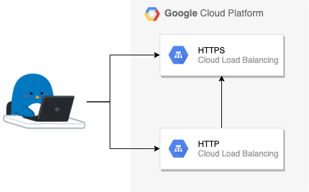
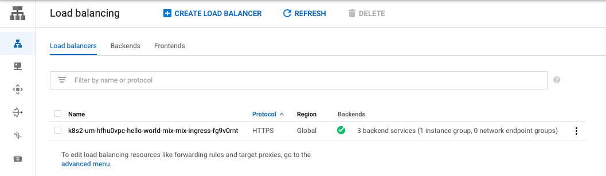
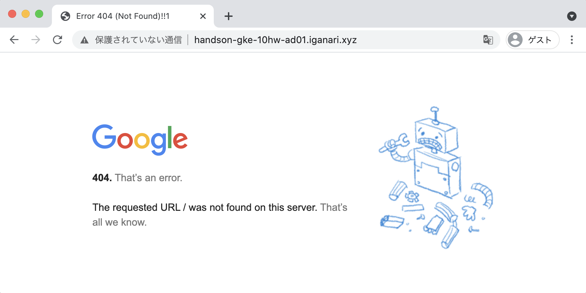
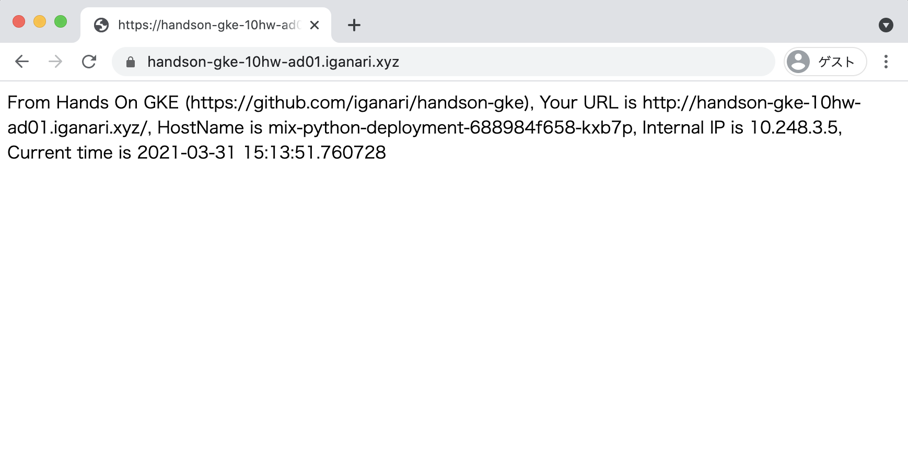

# [WIP] Advansed Q3 Answer

## Q3. HTTP -> HTTPS のリダイレクト設定を追加する

HTTP で来たトラフィックを HTTPS にリダイレクトする設定をマニフェストで実装しましょう

※ Q1 をクリアしている必要があります。




## Answer

+ kind `FrontendConfig` を作成する 
+ Ingress の annotation を設定する

## 参考にする公式ドキュメント

+ Configuring Ingress features / HTTP to HTTPS redirects
  + https://cloud.google.com/kubernetes-engine/docs/how-to/ingress-features?hl=en#https_redirect

# 実際にやってみる

:warning: 既に [Advansed Q1](../01) までの構築が完了していることを前提とします

## 現状の LB のポートを確認する

Q1 では 80 ポートを塞ぎましたが、再度確認しておきます。

プロトコル | cURL での確認 | スクリーンショット
:- | :- | :-

### http の場合

+ cURL での確認

```
# curl -I http://handson-gke-10hw-ad01.iganari.xyz
HTTP/1.1 404 Not Found
Content-Type: text/html; charset=UTF-8
Referrer-Policy: no-referrer
Content-Length: 1561
Date: Thu, 01 Apr 2021 00:36:54 GMT
```

+ Web ブラウザによる確認



### https の場合

+ cURL での確認

```
# curl -I https://handson-gke-10hw-ad01.iganari.xyz
HTTP/2 200
content-type: text/html; charset=utf-8
content-length: 236
server: Werkzeug/1.0.1 Python/3.7.10
date: Thu, 01 Apr 2021 00:37:00 GMT
via: 1.1 google
alt-svc: clear
```

+ Web ブラウザによる確認



### GCP コンソールから確認 



## FrontendConfig の設定追加

以下を `hello-world-ad03-frontendconfig.yaml` として保存する


```
apiVersion: networking.gke.io/v1beta1
kind: FrontendConfig
metadata:
  name: mix-frontend-config
spec:
  redirectToHttps:
    enabled: true
    responseCodeName: MOVED_PERMANENTLY_DEFAULT
```