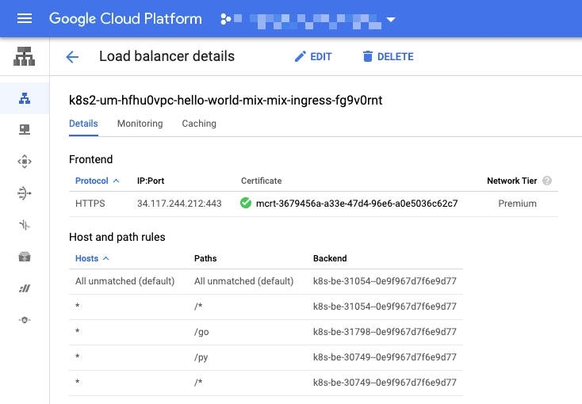
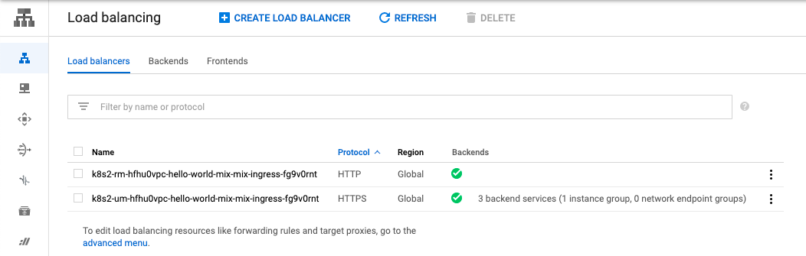
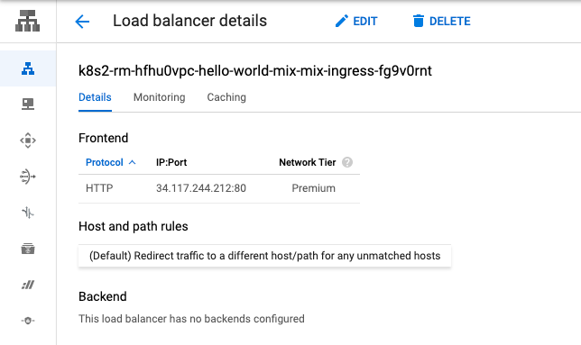

# Advansed Q3 Answer

## Q3. HTTP -> HTTPS のリダイレクト設定を追加する

HTTP で来たトラフィックを HTTPS にリダイレクトする設定をマニフェストで実装しましょう

※ Q1 をクリアしている必要があります。


## Answer

+ kind `FrontendConfig` を作成する 
+ Ingress の annotation を設定する

## 参考にする公式ドキュメント

+ Configuring Ingress features / Associating FrontendConfig with your Ingress
  + https://cloud.google.com/kubernetes-engine/docs/how-to/ingress-features?hl=en#associating_frontendconfig_with_your_ingress
+ Configuring Ingress features / HTTP to HTTPS redirects
  + https://cloud.google.com/kubernetes-engine/docs/how-to/ingress-features?hl=en#https_redirect

# 実際にやってみる

:warning: 既に [Advansed Q1](../01) までの構築が完了していることを前提とします

## 現状の LB を確認

Q1 では 80 ポートを塞ぎましたが、再度確認しておきます。

### GCP コンソールから確認


### http の場合

+ cURL での確認

```
# curl -I http://handson-gke-10hw-ad01.iganari.xyz
HTTP/1.1 404 Not Found
Content-Type: text/html; charset=UTF-8
Referrer-Policy: no-referrer
Content-Length: 1561
Date: Thu, 01 Apr 2021 00:36:54 GMT
```

+ Web ブラウザによる確認


### https の場合

+ cURL での確認

```
# curl -I https://handson-gke-10hw-ad01.iganari.xyz
HTTP/2 200
content-type: text/html; charset=utf-8
content-length: 236
server: Werkzeug/1.0.1 Python/3.7.10
date: Thu, 01 Apr 2021 00:37:00 GMT
via: 1.1 google
alt-svc: clear
```

+ Web ブラウザによる確認


### GCP コンソールから確認 



## FrontendConfig の設定追加

+ 以下を `hello-world-ad03-frontendconfig.yaml` として保存する

```
apiVersion: networking.gke.io/v1beta1
kind: FrontendConfig
metadata:
  name: mix-frontend-config
  namespace: hello-world-mix
spec:
  redirectToHttps:
    enabled: true
    responseCodeName: MOVED_PERMANENTLY_DEFAULT
```

+ デプロイ

```
kubectl apply -f hello-world-ad03-frontendconfig.yaml
```

+ 確認

```
kubectl get FrontendConfig --namespace hello-world-mix
```
```
# kubectl get FrontendConfig --namespace hello-world-mix
NAME                  AGE
mix-frontend-config   28s
```

## ingress を修正

`hello-world-mix.yaml` の ingress の設定部分を修正する

+ 修正前

```
apiVersion: extensions/v1beta1
kind: Ingress
metadata:
  name: mix-ingress
  namespace: hello-world-mix
  annotations:
    kubernetes.io/ingress.global-static-ip-name: "mix-ip-addr"
    kubernetes.io/ingress.allow-http: "false"
    networking.gke.io/managed-certificates: "mix-certificate"
  labels:
    app: mix
spec:

...以下割愛
```

+ 修正後
  + HTTP を受け付けない設定を削除
  + Annotation に FrontendConfig の設定を追加

```
apiVersion: extensions/v1beta1
kind: Ingress
metadata:
  name: mix-ingress
  namespace: hello-world-mix
  annotations:
    kubernetes.io/ingress.global-static-ip-name: "mix-ip-addr"
    networking.gke.io/managed-certificates: "mix-certificate"
    networking.gke.io/v1beta1.FrontendConfig: "mix-frontend-config"
  labels:
    app: mix
spec:

...以下割愛
```

+ 修正内容をデプロイ

```
kubectl apply -f hello-world-mix.yaml
```

## 設定反映後の LB を確認

### GCP コンソールから確認

+ HTTP と HTTPS が存在している



+ HTTP の方を確認すると `redirect traffic` な URL Map であることが分かる



+ cURL での確認
  + HTTP にアクセスした場合、301 リダイレクトで HTTPS にリダイレクトされているのが分かる

```
$ curl -I http://handson-gke-10hw-ad01.iganari.xyz -L
HTTP/1.1 301 Moved Permanently
Cache-Control: private
Content-Type: text/html; charset=UTF-8
Referrer-Policy: no-referrer
Location: https://handson-gke-10hw-ad01.iganari.xyz/
Content-Length: 239
Date: Thu, 01 Apr 2021 05:50:14 GMT

HTTP/2 200
content-type: text/html; charset=utf-8
content-length: 236
server: Werkzeug/1.0.1 Python/3.7.10
date: Thu, 01 Apr 2021 05:50:15 GMT
via: 1.1 google
alt-svc: clear
```

+ Web ブラウザによる確認

```
HTTP にアクセスしたところ、HTTPS にリダイレクトするだけなので割愛
```

## まとめ

Q3 にて、GCLB を使った HTTP -> HTTPS のリダイレクト設定が出来ました

Have fan !! :)
